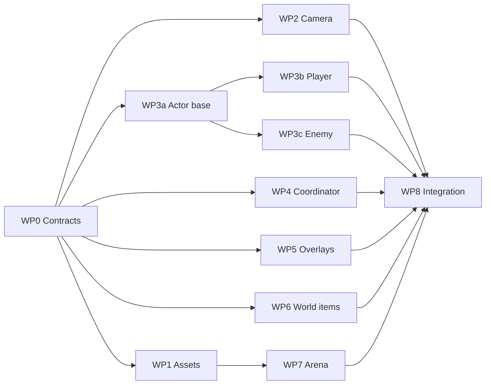

# Shared Fate 3D Test Plan

As of 2026-09-19. Shared doc: https://claude.ai/code/artifact/f82b41f3-cc89-44d2-820e-f0193002954e

## Summary

A 3D test of Shared Fate is realistic as a vertical slice: one arena, the three souls, one enemy type, exploration, turn combat, loot and the existing screens. The rules (`soul.gd`, `item.gd`, `inventory.gd`, the story system) and the Control-based screens are already independent of 2D and carry over. The port is the coordinator (`main.gd`), the two actor scripts, navigation, the levels and the combat overlays: about 4,000 of the 8,450 lines of GDScript, and 313 of the 560 calls into 2D-only engine APIs sit in those three scripts.

Recommended approach: work on a branch inside the same Godot project, in new `3d` folders, copying rather than editing the three big scripts, so the 2D game stays exactly as it is. Split the port into eight work packages with written contracts so several agents can work in parallel after one architect pass. Use Claude Fable 5.1 for the architecture, the coordinator port and integration, Claude Opus 5 for the bulk of the porting and the Blender asset work, and Claude Sonnet 5 for the contained, well-specified packages. Assumes the low-poly, procedurally generated character style from the knight model built on 2026-09-19.

## What carries over and what must be rebuilt

The pure rules have no 2D dependency at all, the screens only need position adapters, and the port concentrates in three files. Counts are from the repository on 2026-09-19; "2D API hits" are references to 2D-only engine classes and calls.

| Area | Files | Lines | 2D API hits | Port size |
| --- | --- | --- | --- | --- |
| Rules and data | soul, item, inventory, story/*, ui_theme | ~900 | 0 | none |
| Screens (Control UI) | inventory_screen, loot_menu, story_book, turn UI in main | ~1,500 | ~40, mostly positions | S |
| Coordinator | main.gd | 1,965 | 147 | L |
| Actors | player.gd, enemy.gd | 1,937 | 166 | L |
| Combat overlays | combat_fx, range_ring, counter_prompt, path preview | ~450 | ~25 | M |
| Levels and generators | main, castle, forest, black_woods scenes; build_black_woods | - | 85 in the generator | L |
| Procedural pixel art | *_art.gd, item_factory textures | ~900 | few | keep as UI icons |

Sizes are rough estimates of focused work: S under a day, M a few days, L a week or more. The 199 uses of `Vector2` in main, player and enemy are the main bug source, because 2D y becomes 3D z. Two things simplify in 3D: the four-direction sprite handling and the weapon flip root disappear, since a model just rotates, and the turn-meter lookup (`_get_turn_meter_world_units`, today derived from tilemap cell spacing) collapses to 1.0 when 1 unit = 1 m.

## The work for a playable slice

Seven steps take the game from the current 2D hub to one 3D arena with the full combat loop. Steps 2 to 6 are independent of each other once step 1 has fixed the conventions.

1. **Machine and pipeline.** Install the Godot editor version the project declares (`config/features` says 4.7) on the Windows PC before opening the project there; the only editor data on that machine was for 4.3. Export models from Blender as `.glb`. Godot can also import `.blend` files directly, but that needs the Blender executable path in editor settings, which is empty here, and it makes imports depend on a Blender install on every machine.
2. **Models.** Regenerate the knight with the sword as a separate object so the weapon-holder system keeps working, and add rogue and mage variants from the same generator script. Add a box wolf, a tree, a crate, a chest and a ground plane. Skip skeletal animation for the test: the current attack feel is procedural lunge, squash and tint, which maps directly to Node3D transforms and a material tint.
3. **Camera and input.** A Camera3D in orthographic mode at a fixed isometric angle keeps the CRPG framing. Click-to-move and click-to-attack become a camera ray against a ground collision layer and enemy bodies instead of `get_global_mouse_position`.
4. **Movement and turn grid.** CharacterBody3D with NavigationAgent3D on a baked NavigationRegion3D; the code pattern (`get_next_path_position`, `move_and_slide`, avoidance) is the same. Keep all cell, path-length and Manhattan math in 2D on the XZ plane and convert only at node boundaries. AStarGrid2D is plain data and needs no change. With 1 unit = 1 m the turn meter is 1.0 and `TURN_MOVE_METERS` stays 6.
5. **Overlays.** Popups anchor to world positions through one helper in `combat_fx.gd` (the canvas transform); swap it for `Camera3D.unproject_position` and the CanvasLayer UI works unchanged. Range rings, the counter prompt and the path preview are custom 2D draws and need flat meshes or projected Controls. Hit flash uses `self_modulate`; in 3D it becomes a per-instance material tint.
6. **World items and lighting.** Pickups become billboard sprites of the existing icons with an Area3D for clicking. PointLight2D and CanvasModulate become an OmniLight3D on the player plus a WorldEnvironment.
7. **One arena.** Build a single small 3D map that meets the `main.gd` node contract (nav region, camera, player, enemies in the `enemies` group, spawn points). Leave the hub, castle, forest and Black Woods for later; the Black Woods generator would need a GridMap-based rewrite.

Parity checklist for the slice: click-to-move, combat start by proximity, movement budget trimming, melee with contact delay, block, parry and ward on the counter prompt, the rogue throw and both mage spells with their rings, one shift per turn, enemy turn pacing, loot drop and pickup, inventory and story book opening.

## Keeping the 2D version

The 2D game stays safe at two levels: a git snapshot you can always return to, and a folder layout in which 3D code is added beside the 2D code instead of replacing it.

1. Tag the current `main` commit as the 2D baseline (`2d-baseline`) and create a branch `feat/3d-test` for all 3D work. The repository is `JuulArthur/SharedFate` on GitHub with `main` and a `combat-feel` branch.
2. Put 3D scenes and scripts under new folders (`scenes/3d`, `scripts/3d`, `assets/3d`). Copy `main.gd`, `player.gd` and `enemy.gd` into 3D variants and port the copies. This duplicates about 3,900 lines for the duration of the test, deliberately: it is the only way to guarantee the 2D scripts do not change.
3. Shared files that both versions use (`combat_fx.gd`, `loot_menu.gd`, `inventory_screen.gd`, `level_loader.gd`, the autoload list in `project.godot`) may only receive additive changes: a new optional projector callback, a new method, never a changed signature or default. A 3D scene registers its adapter at start; a 2D scene never calls the new code.
4. Both versions run from one editor: switch `run/main_scene` or run the 3D arena scene directly with F6. Playing `scenes/main.tscn` after every merge is the regression test that proves the 2D game is untouched.
5. Decision at the end of the test: merge `feat/3d-test` and keep both versions selectable, then decide whether to extract the turn rules from the two coordinators into shared modules; or delete the branch, and nothing has changed.

A separate Godot project folder would isolate harder but makes sharing scripts awkward (Godot only sees files under its own `res://`), so it is not recommended for a test.

## Decision points and risks

Four decisions shape the work more than any technical choice. They were settled on 2026-09-19:

| Decision | Decisions |
| --- | --- |
| Camera | Orthographic, fixed angle: keeps the CRPG framing and makes click picking and the turn grid simpler |
| Character animation | None for the test; a part-based rig is the natural next step and fits generated models |
| World content | Flat ground plus a few generated props; billboards for pickups |
| Sword and gear | Separate object, so the archetype weapon animations and equipment swapping keep working |

Risks:

- **Identity.** The project foundation names 2D sprites and an old-style CRPG look as the goal. Fixed-angle orthographic 3D preserves the framing but changes the feel, and the knight attack strip and critter sprites become portraits or are dropped.
- **Animation cost.** This is the real long-term cost of 3D: every enemy and every new action needs motion. The procedural approach defers it, but it does not go away.
- **Coordinate bugs.** 2D y becomes 3D z in 199 `Vector2` uses across three scripts. The XZ-plane helper and a written convention are the mitigation.
- **Paperdoll and portraits.** The inventory screen crops the world sprite for the character art. Use a SubViewport render of the model, or keep the sprite as a portrait.
- **Editor version.** Opening the project with an older editor than the declared 4.7 can rewrite or break scene files. Match versions on every machine that touches the project.
- **Runtime navmesh baking.** The Black Woods generator relies on 2D tricks (a void tile layer, physics diamonds). A 3D generator needs proper collision geometry before baking, which is new work rather than a port.

## Structuring the rewrite for multiple agents

One architect pass writes the contracts, then up to six agents work in parallel on packages that own disjoint files, and one integrator closes. The coordinator already calls actors duck-typed through `has_method` and `call`, so the actor contract is a list of method names that exists today and only has to be written down.

### Principles

- **Contracts before code.** Package 0 produces one document in the repo (`docs/3d-port-contracts.md`) with: the coordinate conventions (1 unit = 1 m, Y up, forward -Z, ground on the XZ plane), collision layers, the actor method contract, the level node contract, and the `GroundMath` helper API. Every later prompt quotes the part it needs.
- **Disjoint file ownership.** Each package owns a listed set of new files under the `3d` folders. Shared autoloads may be edited only by the package named in the table, only additively. Any edit outside the owned list is a review finding.
- **Stubs first.** Package 0 also delivers an arena skeleton with box placeholders and stub actors that satisfy the contract, so the coordinator and overlay agents can run their work from the first day.
- **One worktree per package.** In Claude Code, run each package in its own session with worktree isolation, on a branch off `feat/3d-test`, merged by the lead through small pull requests. Small, well-specified packages can instead be subagents spawned from the lead session; long packages are better as sessions you can steer.
- **Self-contained prompts.** Each prompt carries the goal, the contract excerpt, the files owned and forbidden, the verification steps and the definition of done. An agent should not need this conversation.
- **Conventions in `CLAUDE.md`.** Put the coordinate and naming conventions there so every session loads them automatically.

### Work packages

| Package | Scope | Owns | Depends on | Size |
| --- | --- | --- | --- | --- |
| WP0 Contracts and skeleton | Tag and branch, folder layout, contracts document, `GroundMath`, stub actors, arena skeleton, `CLAUDE.md` section | `docs/3d-port-contracts.md`, `scripts/3d/ground_math.gd`, `scenes/3d/arena_skeleton.tscn`, stubs | none | M |
| WP1 Assets | Knight with separate sword, rogue and mage variants, wolf, tree, crate, chest, ground; `.glb` export; preview sheet | `assets/3d/*`, `tools/blender/*` | WP0 conventions | M |
| WP2 Camera and picking | Orthographic Camera3D rig, follow and zoom, shake adapter, `WorldPicker` ray into ground, enemies and pickups | `scripts/3d/camera_rig_3d.gd`, `scripts/3d/world_picker.gd` | WP0 | S to M |
| WP3a Actor base | Navigation, movement stepping, turn resources, facing, damage plumbing shared by player and enemy | `scripts/3d/actor_3d_base.gd` | WP0 | M |
| WP3b Player 3D | Souls, melee and ranged attacks, spells, reactions, weapon holder as Node3D, inventory hookup | `scripts/3d/player_3d.gd`, `scenes/3d/player_3d.tscn` | WP3a | L |
| WP3c Enemy 3D | Aggro and chase, attack sequence, counter prompt driving, root, death and loot | `scripts/3d/enemy_3d.gd`, `scenes/3d/enemy_3d.tscn`, `wolf_3d.tscn` | WP3a | M |
| WP4 Coordinator | Port of `main.gd`: state machine, turn flow, engagement radius, path trimming through `GroundMath`, UI reuse | `scripts/3d/main_3d.gd` | WP0; runs on stubs until WP2 and WP3 land | L |
| WP5 Overlays and feel | Projector callback in `CombatFx` (additive), 3D range ring, counter prompt, path preview, health bars, hit tint, ring burst | `scripts/3d/*_3d.gd` for overlays; additive edits in `combat_fx.gd` | WP0 | M |
| WP6 World items | 3D pickup (billboard icon plus Area3D), loot spread in 3D, distance adapter in the loot menu (additive) | `scripts/3d/item_pickup_3d.gd`, `scenes/3d/item_pickup_3d.tscn`; additive edits in `loot_dropper.gd`, `loot_menu.gd` | WP0 | S |
| WP7 Arena | Real arena: ground, props, navmesh bake, lighting, spawn points, level contract | `scenes/3d/arena.tscn` | WP1, WP0 | M |
| WP8 Integration and QA | Wire the packages, run the parity checklist, regression-play the 2D hub, fix cross-package issues | all `3d` files | all | M to L |

### Order of work

Phase 0 is WP0 alone. Phase 1 fans out WP1, WP2, WP3a, WP4, WP5 and WP6. Phase 2 starts WP3b, WP3c and WP7 as their inputs land, while WP4 continues. Phase 3 is WP8. Six agents at once is the practical ceiling; more than that raises merge and review load faster than it saves time.

### Definition of done for every package

- The editor opens the project with no script errors, and the package's own test scene runs.
- Every method in the contract excerpt is implemented or explicitly stubbed with a comment.
- `git diff --stat 2d-baseline -- scenes scripts` shows only files under the `3d` folders plus the additive files the package is allowed to touch.
- `scenes/main.tscn` still plays: click-to-move, one fight, one loot pickup.
- The pull request lists every deviation from the contract, so the lead can update the contracts document before the next package reads it.

## Which Claude model for which package

Use Claude Fable 5.1 where a mistake propagates into every other package, Claude Opus 5 for the bulk of the porting, and Claude Sonnet 5 for small packages with a tight contract. In Claude Code the model is chosen per session in the model picker, and per subagent through the Agent tool's model option, so mixing models across packages costs nothing in setup.

| Package | Model | Why |
| --- | --- | --- |
| WP0 Contracts and skeleton | Claude Fable 5.1 | Reads about 4,000 lines and designs the contracts every other agent builds on; errors here multiply |
| WP4 Coordinator | Claude Fable 5.1 | The largest and most intertwined port, with the y-to-z pitfalls and coroutine-based turn flow |
| WP3b Player 3D | Claude Fable 5.1 | 1,355 lines covering souls, spells, reactions, weapon animations and coroutines |
| WP8 Integration and QA | Claude Fable 5.1 | Cross-package debugging with the whole system in context |
| WP3a Actor base | Claude Opus 5 | Well-scoped movement and turn-resource port |
| WP3c Enemy 3D | Claude Opus 5 | Moderate size, clear contract, one tricky part (the counter prompt timing) |
| WP2 Camera and picking | Claude Opus 5 | Needs solid Godot 3D knowledge but a small surface |
| WP5 Overlays and feel | Claude Opus 5 | Visual judgement plus careful additive edits to a shared autoload |
| WP1 Assets | Claude Opus 5, then Claude Sonnet 5 | Opus to extend the generator and judge renders; Sonnet for the variants once the generator exists |
| WP6 World items | Claude Sonnet 5 | Small and fully specified by the contract |
| WP7 Arena | Claude Sonnet 5 | Scene assembly; escalate to Opus 5 if navmesh baking misbehaves |
| Code review of WP3b and WP4 | Claude Fable 5.1 | Same reasoning as the packages themselves |
| Code review of the rest | Claude Opus 5 | Sufficient for contained packages |
| Searches, log summaries, renames | Claude Haiku 4.5 | Mechanical work only; never for porting logic |

List API prices per million tokens, as cached in the model reference on 2026-06-24; Claude Code plan accounting may differ:

| Model | Input | Output |
| --- | --- | --- |
| Claude Fable 5.1 | $10.00 | $50.00 |
| Claude Opus 5 | $5.00 | $25.00 |
| Claude Sonnet 5 | $2.00 | $10.00 |
| Claude Haiku 4.5 | $1.00 | $5.00 |

Two practical notes. Fable 5.1 takes longer single turns on hard tasks and does best with the full package specification given up front, which the self-contained prompts provide. For every model, keep effort at high or above for the porting packages; low effort is for the mechanical subagent tasks.

## Next steps

- [x] Settle the four decisions in the table above (camera, animation, world content, held gear).
- [x] Install the Godot editor matching the project's declared version on the Windows PC; confirm the Mac editor matches.
- [x] Tag `2d-baseline` and create the `feat/3d-test` branch (2026-09-20).
- [x] Run WP0 with Claude Fable 5.1 (2026-09-20). Read `docs/3d-port-contracts.md` before merging phase 1.
- [x] Start phase 1: one worktree and one session per package, prompts built from the contracts document (2026-09-20).
- [x] Merge phase 1, start phase 2 as inputs land, then WP8 (all nine packages merged on `feat/3d-test` by 2026-09-25; every finding folded into `docs/3d-port-contracts.md`; the slice's acceptance test prints `INTEGRATION OK`, see `docs/3d-arena.md`).
- [ ] Play the arena (`scenes/3d/arena.tscn`, F6) and the 2D hub side by side, then decide: merge and keep both, or delete the branch.
- [ ] Open decisions after the slice: swap bodies per soul (`rogue.glb` and `mage.glb` are imported but unused), a story chapter for the arena, a hub link, and whether to extract the turn rules shared by `main.gd` and `main_3d.gd`.
